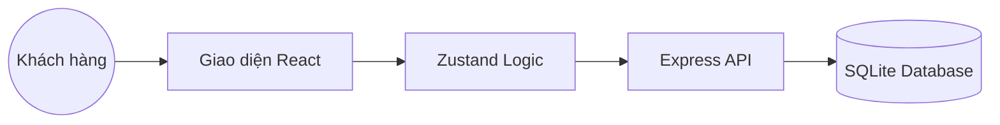

# ⚡ Linh Kiện Chuẩn Giá - Hệ Thống Quản Lý & Kinh Doanh Linh Kiện Điện Tử


**Linh Kiện Chuẩn Giá** là một nền tảng thương mại điện tử chuyên nghiệp được thiết kế tối ưu cho việc kinh doanh linh kiện điện tử tại Việt Nam. Dự án kết hợp sức mạnh của công nghệ hiện đại với quy trình nghiệp vụ thực tế, mang lại trải nghiệm mua sắm mượt mà cho khách hàng và bộ công cụ quản trị mạnh mẽ cho doanh nghiệp.

---

## 🌟 1. Tổng Quan Dự Án
Dự án được xây dựng với mục tiêu giải quyết bài toán quản lý tồn kho phức tạp và quy trình xử lý đơn hàng đa bước trong ngành điện tử. Điểm đặc biệt của hệ thống là việc sử dụng **100% ngôn ngữ tiếng Việt** trong cấu trúc dữ liệu và logic nghiệp vụ, giúp đội ngũ vận hành dễ dàng tiếp cận và làm chủ hệ thống.

---

## ✨ 2. Các Tính Năng Nổi Bật

### 🛒 Dành Cho Khách Hàng
- **Giao diện hiện đại**: Thiết kế Responsive, hỗ trợ Dark Mode, tối ưu trải nghiệm trên di động.
- **Tìm kiếm thông minh**: Lọc sản phẩm theo danh mục, thương hiệu và mức giá.
- **Giỏ hàng & Thanh toán**: Quy trình đặt hàng tối giản, hỗ trợ nhiều phương thức vận chuyển và thanh toán (COD/Online).
- **Theo dõi đơn hàng**: Cập nhật trạng thái đơn hàng theo thời gian thực (Chờ xử lý, Đang giao, Thành công).
- **Flash Sale**: Hệ thống tự động cập nhật giá ưu đãi theo cấu hình của quản trị viên.

### 🛡️ Dành Cho Quản Trị & Nhân Viên (RBAC)
Hệ thống phân quyền chuyên sâu (Role-Based Access Control) giúp chuyên môn hóa đội ngũ:
- **👑 Admin**: Giám sát doanh thu, quản lý nhân sự và cấu hình hệ thống.
- **📦 Quản lý Sản phẩm**: Điều chỉnh kho hàng, cập nhật thông số kỹ thuật và giá bán.
- **📝 NV Quản lý Đơn hàng**: Chuyên trách tiếp nhận đơn, xác nhận thông tin khách và vận chuyển.
- **👤 Khách hàng**: Xem sản phẩm, mua sắm và theo dõi hành trình đơn hàng của mình.

---

## 🛠️ 3. Công Nghệ Sử Dụng

### Frontend
- **React 19 & Vite**: Tốc độ tải trang cực nhanh, tối ưu hóa hiệu năng render.
- **Zustand**: Quản lý trạng thái (State) tập trung, hỗ trợ lưu trữ dữ liệu bền vững (Persistence).
- **Tailwind CSS**: Thiết kế giao diện linh hoạt, hiện đại và đồng bộ.
- **Lucide Icons**: Bộ icon dạng vector sắc nét và chuyên nghiệp.

### Backend & Database
- **Node.js & Express**: Xử lý logic nghiệp vụ phía máy chủ ổn định và mạnh mẽ.
- **Prisma ORM**: Tương tác cơ sở dữ liệu an toàn (Type-safe), dễ dàng mở rộng.
- **SQLite**: Lưu trữ dữ liệu gọn nhẹ, tính di động cao (Phù hợp cho cả Demo và Production nhỏ).
- **JWT & Bcrypt**: Bảo mật thông tin người dùng và xác thực phiên đăng nhập.

---

## 📐 4. Kiến Trúc Hệ Thống

Hệ thống được thiết kế theo mô hình 4 lớp đảm bảo tính tách biệt và dễ bảo trì:



- **Lớp Giao diện (UI)**: Tập trung vào trải nghiệm người dùng và tính thẩm mỹ.
- **Lớp Nghiệp vụ (Logic Store)**: Nơi xử lý các tính toán giỏ hàng, phân quyền và trạng thái.
- **Lớp Ánh xạ (Mapping)**: Đảm bảo dữ liệu giữa Backend và Frontend luôn nhất quán theo chuẩn tiếng Việt.
- **Lớp Dữ liệu (Database)**: Được bảo vệ bởi Prisma, chống SQL Injection và mất mát dữ liệu.

---

## 🔑 5. Tài Khoản Trải Nghiệm (Demo)

Dành cho nhà phát triển và khách hàng muốn kiểm tra các chức năng quản trị:

| Vai trò | Email | Mật khẩu | Quyền hạn chính |
| :--- | :--- | :--- | :--- |
| **Admin** | `admin@test.com` | `password123` | Toàn quyền hệ thống |
| **NV Sản phẩm** | `product@test.com` | `product123` | Quản lý kho & giá |
| **NV Đơn hàng** | `order@test.com` | `order123` | Xử lý vận chuyển |
| **Khách hàng** | `user@test.com` | `user123` | Mua sắm & Theo dõi |

---

## 🚀 6. Hướng Dẫn Khởi Chạy

Để chạy dự án này trên máy cục bộ, hãy thực hiện các bước sau:

1. **Clone dự án**:
   ```bash
   git clone https://github.com/Piibruh/linh-kien-chuan-gia.git
   ```
2. **Cài đặt thư viện**:
   ```bash
   npm install
   ```
3. **Cấu hình Database**:
   ```bash
   npx prisma db push
   ```
4. **Khởi chạy hệ thống**:
   ```bash
   npm run dev
   ```
   *Truy cập: [http://localhost:5174](http://localhost:5174)*

---

## 📄 7. Tài Liệu Hỗ Trợ
Chúng tôi cung cấp bộ tài liệu chi tiết giúp bạn làm chủ dự án trong thư mục `tai-lieu-du-an/`:
- 📂 `KIEU_TRUC_HE_THONG.md`: Chi tiết về luồng hàm và sơ đồ kỹ thuật.
- 📂 `HUONG_DAN_CODE.md`: Hướng dẫn cách chỉnh sửa và mở rộng tính năng.
- 📂 `50_CAU_HOI_VAN_DAP.md`: Bộ câu hỏi ôn tập cho các kỳ bảo vệ đồ án.

---

## 🤝 8. Liên Hệ & Đóng Góp
Dự án được phát triển với tinh thần chia sẻ kiến thức. Mọi đóng góp về mã nguồn hoặc báo lỗi vui lòng mở **Issue** trên GitHub.

© 2026 **Linh Kiện Chuẩn Giá**. Thiết kế với sự tận tâm cho cộng đồng điện tử Việt Nam.
