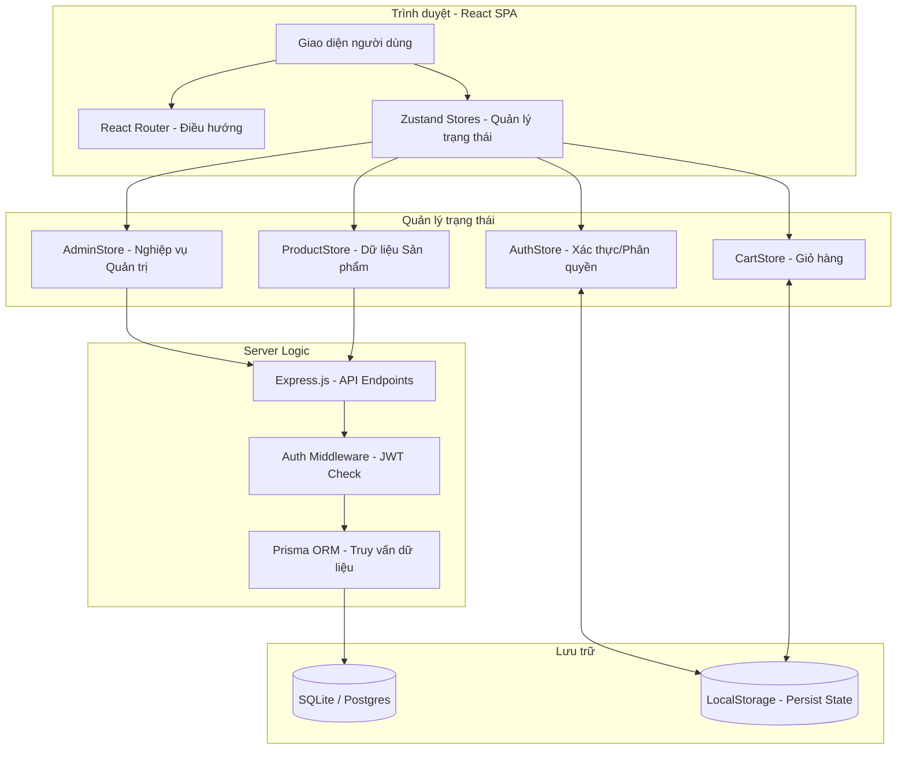

# 🏗️ Kiến trúc hệ thống - Linh Kiện Chuẩn Giá

Tài liệu này chi tiết hóa cấu trúc kỹ thuật, luồng dữ liệu và mối quan hệ giữa các thành phần trong hệ thống.

---

## 1. Sơ đồ kiến trúc tổng quan (High-Level Architecture)

---

## 2. Chi tiết các Store & Hàm chức năng

### 🔐 AuthStore (`authStore.ts`)
Quản lý trạng thái đăng nhập và phân quyền (RBAC).

| Hàm | Mô tả | Tham số |
| :--- | :--- | :--- |
| `login` | Đăng nhập người dùng và lưu JWT | `email, password` |
| `register` | Đăng ký tài khoản mới | `userData` |
| `logout` | Xóa trạng thái đăng nhập và token | - |
| `can` | **Quan trọng**: Kiểm tra quyền hạn dựa trên Permission Matrix | `permission: Permission` |
| `updateProfile`| Cập nhật thông tin cá nhân | `partialData` |

### 🛠 AdminStore (`adminStore.ts`)
Trung tâm điều phối các hoạt động quản trị.

| Hàm | Mô tả | Đối tượng tác động |
| :--- | :--- | :--- |
| `fetchStats` | Lấy dữ liệu thống kê (Doanh thu, Đơn hàng...) | Dashboard |
| `addProduct` | Thêm sản phẩm mới vào hệ thống | Sản phẩm |
| `updateProduct`| Chỉnh sửa thông tin sản phẩm | Sản phẩm |
| `deleteProduct`| Xóa sản phẩm | Sản phẩm |
| `updateOrderStatus`| Chuyển trạng thái đơn (Chờ -> Giao -> Hoàn thành) | Đơn hàng |
| `addCategory` | Tạo danh mục mới | Danh mục |
| `updateUserRole`| Thay đổi quyền hạn người dùng (RBAC) | Người dùng |
| `updateConfig` | Cấu hình hệ thống (Flash Sale, Banner...) | Cài đặt |

### 🛒 CartStore (`cartStore.ts`)
Xử lý logic giỏ hàng phía Client.

| Hàm | Mô tả |
| :--- | :--- |
| `addToCart` | Thêm sản phẩm vào giỏ, tự động cộng dồn số lượng |
| `removeFromCart`| Xóa sản phẩm khỏi giỏ |
| `updateQuantity`| Thay đổi số lượng mua của một sản phẩm |
| `clearCart` | Làm trống giỏ hàng sau khi đặt hàng thành công |

---

## 3. Luồng dữ liệu và Tương quan liên kết

### Luồng Phân quyền (RBAC Flow)
1. **Đăng nhập**: `AuthStore.login` nhận dữ liệu người dùng bao gồm `role`.
2. **Giao diện**: `AdminDashboard` gọi `AuthStore.can('manage_products')`.
3. **Logic**: Nếu `can` trả về `true`, các nút "Thêm", "Sửa", "Xóa" sẽ được render.
4. **Điều hướng**: `RequireRole` guard trong `routes.tsx` bảo vệ các route cấp cao.

### Luồng Đặt hàng (Order Flow)
1. **Lựa chọn**: `ProductStore` cung cấp danh sách -> Khách hàng chọn.
2. **Giỏ hàng**: `CartStore.addToCart` lưu trữ tạm thời trong `LocalStorage`.
3. **Thanh toán**: `CheckoutPage` thu thập thông tin -> Gọi API tạo đơn hàng.
4. **Xử lý**: `AdminStore` nhận thông báo đơn hàng mới -> Nhân viên (Order Staff) cập nhật trạng thái qua `updateOrderStatus`.

### Luồng Flash Sale (Flash Sale Flow)
1. **Cấu hình**: Admin đặt `flashSaleThreshold` và chọn sản phẩm thủ công qua `AdminStore.updateConfig`.
2. **Hiển thị**: `HomePage` lọc sản phẩm từ `ProductStore` dựa trên cấu hình Flash Sale hiện tại.
3. **Thời gian**: Hệ thống đếm ngược đồng bộ giữa Client và Server để đảm bảo tính công bằng.

---

## 4. Công nghệ bổ trợ (Utilities)

- **`lib/utils.ts`**: Chứa các hàm định dạng tiền tệ (`formatCurrency`), xử lý class name (`cn`).
- **`lib/order-mapping.ts`**: Chuyển đổi dữ liệu đơn hàng giữa định dạng Server và UI.
- **`prisma/schema.prisma`**: Định nghĩa cấu trúc Database (Schema).

---
*Tài liệu này được tự động cập nhật dựa trên phiên bản mới nhất của hệ thống.*
