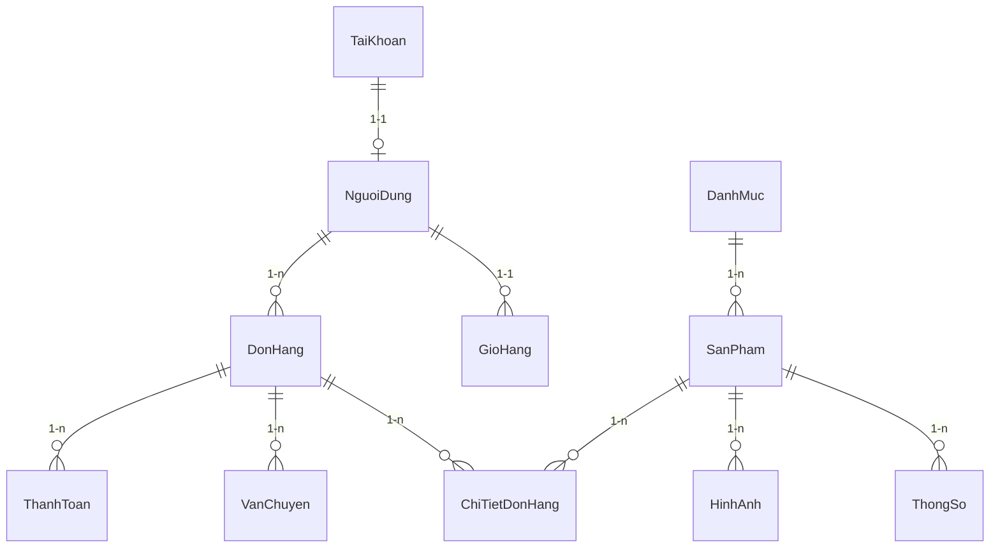

# Chi Tiết Cơ Sở Dữ Liệu - Linh Kiện Chuẩn Giá

Dự án sử dụng cơ sở dữ liệu quan hệ được chuẩn hóa thành 12 bảng để đảm bảo tính toàn vẹn dữ liệu và khả năng mở rộng.

## 1. Sơ đồ Quan hệ (ERD)

---

## 2. Chi Tiết Các Bảng

### 2.1. Nhóm Tài khoản & Người dùng
1. **TaiKhoan**: Lưu trữ thông tin đăng nhập (username, password, role).
2. **NguoiDung**: Thông tin chi tiết (họ tên, email, SDT, địa chỉ) liên kết với tài khoản qua `maTaiKhoan`.

### 2.2. Nhóm Sản phẩm & Danh mục
3. **DanhMuc**: Phân loại sản phẩm (VD: IC, Điện trở, Tụ điện).
4. **SanPham**: Thông tin cốt lõi của sản phẩm bao gồm giá bán, tồn kho, và các trường SEO.
5. **ThongSo**: Các thông số kỹ thuật động (VD: Điện áp, Dòng điện, Tần số).
6. **HinhAnh**: Lưu URL ảnh, thứ tự hiển thị và đánh dấu ảnh đại diện (`laAnhChinh`).

### 2.3. Nhóm Đơn hàng & Thanh toán
7. **DonHang**: Chứa thông tin tổng quan, trạng thái xử lý và tổng tiền.
8. **ChiTietDonHang**: Lưu lại giá và số lượng tại thời điểm đặt hàng.
9. **ThanhToan**: Phương thức (COD/Online) và trạng thái thanh toán.
10. **VanChuyen**: Đối tác vận chuyển và phí vận chuyển.

### 2.4. Nhóm Tương tác
11. **GioHang**: Giỏ hàng tạm thời của khách hàng.
12. **DanhGia**: Phản hồi và điểm số sao cho từng sản phẩm.

---

## 3. Các Trạng Thái Quan Trọng

### Trạng thái Đơn hàng (`DonHang.trangThai`):
- `Cho_Xu_Ly`: Đơn hàng mới đặt thành công.
- `Da_Xac_Nhan`: Nhân viên đã kiểm kho và liên hệ khách hàng.
- `Dang_Giao`: Đã gửi đơn cho đơn vị vận chuyển.
- `Thanh_Cong`: Khách đã nhận hàng và hoàn tất thanh toán.
- `Da_Huy`: Đơn bị hủy (kèm lý do).

### Trạng thái Thanh toán (`ThanhToan.trangThai`):
- `Chua_Thanh_Toan`: Đối với đơn COD.
- `Da_Thanh_Toan`: Đối với đơn Chuyển khoản (xác nhận thành công).
