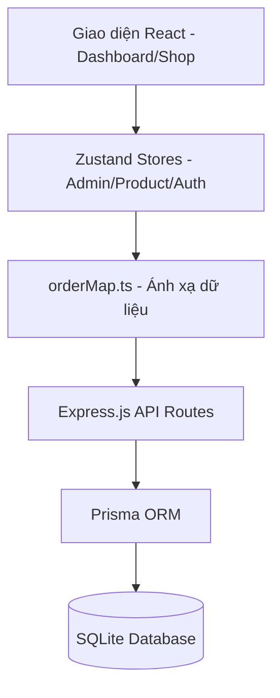
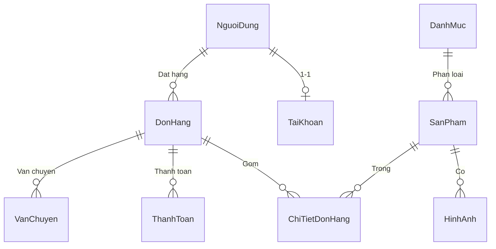

# 📐 Kiến Trúc Kỹ Thuật - Linh Kiện Chuẩn Giá

Tài liệu này chi tiết về cấu trúc mã nguồn, các hàm nghiệp vụ và mối quan hệ giữa các thành phần trong hệ thống.

---

## 🏗️ 1. Sơ Đồ Luồng Dữ Liệu (Data Flow)

---

## 📊 2. Sơ Đồ Cơ Sở Dữ Liệu (ER Diagram)

Dựa trên chuẩn tiếng Việt mới nhất:

---

## 🛠️ 3. Các Hàm Nghiệp Vụ Chính

### 📦 Quản lý Sản phẩm (`adminStore.ts`)
| Hàm | Mô tả | Đầu vào |
| :--- | :--- | :--- |
| `addProduct` | Thêm linh kiện mới vào hệ thống | `ProductData` |
| `updateProduct` | Cập nhật thông tin (giá, tồn kho, tên) | `maSanPham`, `Updates` |
| `deleteProduct` | Xóa sản phẩm khỏi danh sách | `maSanPham` |
| `updateStoreConfig` | Cấu hình ngưỡng Flash Sale toàn hệ thống | `StoreConfig` |

### 📝 Quản lý Đơn hàng (`adminStore.ts`)
| Hàm | Mô tả | Đầu vào |
| :--- | :--- | :--- |
| `createOrder` | Tạo đơn hàng mới (Hỗ trợ Offline fallback) | `CreateOrderPayload` |
| `updateOrderStatus` | Luồng: Chờ -> Xử lý -> Giao -> Thành công | `maDonHang`, `trangThai` |
| `markOrderCodCollected` | Xác nhận đã thu tiền hộ (COD) | `maDonHang` |
| `cancelOrderByCustomer`| Hủy đơn hàng kèm lý do | `maDonHang`, `lyDo` |

### 🔐 Xác thực & Phân quyền (`authStore.ts`)
| Hàm | Mô tả | Trạng thái |
| :--- | :--- | :--- |
| `login` | Kiểm tra email/pass và cấp Token JWT | `Email`, `Password` |
| `logout` | Xóa phiên đăng nhập, reset state | - |
| `can` | Kiểm tra quyền hạn trước khi thực thi (RBAC) | `PermissionName` |

---

## 🔗 4. Tương Quan Liên Kết (Logic Chains)

1. **Chu kỳ Đơn hàng**:
   - `createOrder` -> Tạo bản ghi `DonHang` & `ChiTietDonHang`.
   - `updateOrderStatus` -> Kích hoạt `applyLocalStatusUpdate` để cập nhật các mốc thời gian (`confirmedAt`, `shippedAt`...).
   - `markOrderCodCollected` -> Cập nhật `paymentStatus` sang `paid`.

2. **Logic Flash Sale**:
   - `updateStoreConfig` lưu danh sách `maSanPham` giảm giá.
   - `getProductsFromAdminStore` (trong `productStore.ts`) sẽ so khớp `maSanPham` để tính toán lại `giaBan` thực tế trước khi hiển thị cho khách hàng.

3. **Luồng Ánh Xạ (Mapping)**:
   - Dữ liệu thô từ DB (Prisma) được đi qua `mapPrismaOrderToStore` để chuyển đổi sang kiểu `Order` mà Frontend hiểu được, đảm bảo tính nhất quán của tên trường tiếng Việt.

---

## 📁 5. Cấu Trúc Thư Mục Kỹ Thuật
- `/prisma/schema.prisma`: Định nghĩa Schema chuẩn Việt Nam.
- `/src/store`: Quản lý trạng thái ứng dụng (Logic nghiệp vụ tập trung).
- `/src/lib/orderFlow.ts`: Định nghĩa các trạng thái đơn hàng (Enum).
- `/src/app/pages/admin-dashboard.tsx`: Giao diện quản trị tập trung (Monolithic component).

---
*Tài liệu này được cập nhật tự động theo trạng thái mới nhất của dự án.*
