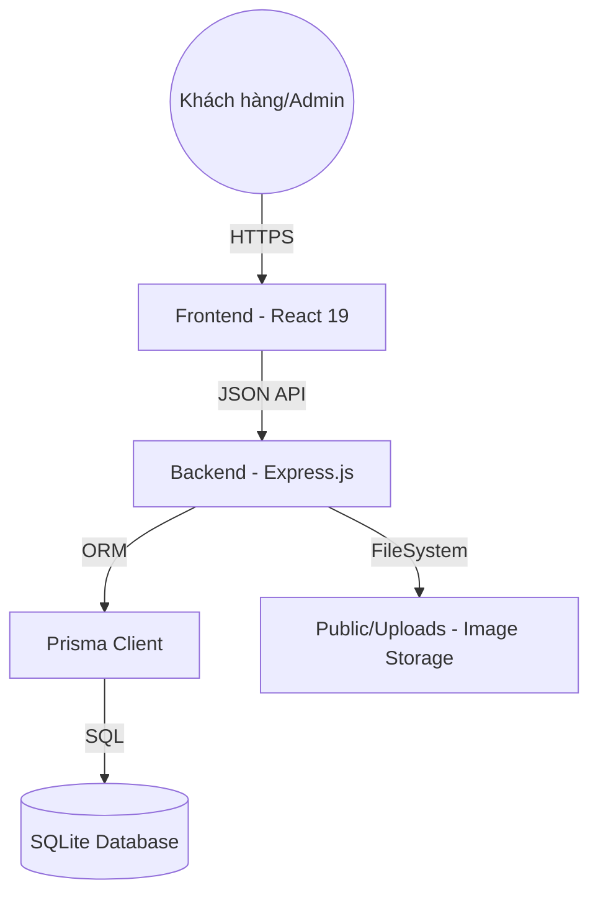

# Kiến Trúc Hệ Thống - Linh Kiện Chuẩn Giá

Tài liệu này phân tích cấu trúc kỹ thuật và luồng xử lý của hệ thống, giúp lập trình viên hiểu rõ cách các thành phần tương tác với nhau.

## 1. Mô Hình Tổng Quan (C4 Model - Level 2)

Hệ thống được xây dựng theo kiến trúc Client-Server hiện đại, sử dụng Node.js làm cầu nối giữa giao diện người dùng và cơ sở dữ liệu.

---

## 2. Các Lớp Thành Phần

### 2.1. Frontend Layer (React & Vite)
- **Framework**: React 19 khai thác các tính năng mới nhất về hiệu năng.
- **State Management**: **Zustand** được chọn vì tính đơn giản, hiệu quả và hỗ trợ tốt cho việc lưu trữ giỏ hàng bền vững (local storage persistence).
- **Styling**: **Tailwind CSS** đảm bảo tính nhất quán trong thiết kế và khả năng tùy biến cao.
- **Routing**: React Router quản lý điều hướng mượt mà không cần tải lại trang.

### 2.2. Backend Layer (Express.js)
- **Middleware**: Sử dụng `cors`, `helmet`, và `express.json` để bảo mật và xử lý dữ liệu.
- **File Handling**: **Multer** được cấu hình để quản lý việc upload ảnh sản phẩm trực tiếp vào máy chủ, thay vì lưu chuỗi Base64 dài vào Database, giúp tối ưu hóa dung lượng DB và tốc độ truy xuất.

### 2.3. Database Layer (Prisma & SQLite)
- **Prisma ORM**: Đóng vai trò lớp trung gian giúp tương tác với DB bằng TypeScript/JavaScript một cách an toàn (Type-safe).
- **SQLite**: Được sử dụng làm hệ quản trị cơ sở dữ liệu vì tính gọn nhẹ, không cần cài đặt server phức tạp nhưng vẫn đảm bảo tính toàn vẹn dữ liệu quan hệ.

---

## 3. Luồng Xử Lý Đặc trưng (Feature Flows)

### 3.1. Luồng Thanh toán & Ship
1. Khách hàng thêm sản phẩm vào giỏ hàng (`useCartStore`).
2. Giỏ hàng kiểm tra ngưỡng **50.000₫**. Nếu không đủ, nút thanh toán sẽ bị khóa.
3. Tại trang Checkout, người dùng chọn phương thức thanh toán.
4. Hệ thống tự động gán phí ship dựa trên `paymentMethod`:
   - `online` -> Freeship toàn quốc.
   - `cod` -> Hiện ghi chú HN/Tỉnh và set phí tính sau.

### 3.2. Luồng Quản lý Ảnh Sản phẩm
1. Admin chọn ảnh từ máy tính.
2. `ImageUploader` thực hiện nén ảnh về kích thước tối ưu (800px width).
3. Ảnh được gửi lên API qua `multipart/form-data`.
4. Server lưu ảnh vào `public/uploads/products/` và trả về URL file.
5. URL ảnh và các metadata (thứ tự, ảnh chính) được lưu vào bảng `HinhAnh` thông qua Prisma.

---

## 4. Bảo Mật & Phân Quyền
- **Xác thực**: Sử dụng JWT (JSON Web Token) để quản lý phiên làm việc.
- **Phân quyền (RBAC)**:
  - `Admin`: Toàn quyền.
  - `Staff`: Quản lý kho và đơn hàng.
  - `User`: Chỉ có quyền mua hàng và quản lý tài khoản cá nhân.
